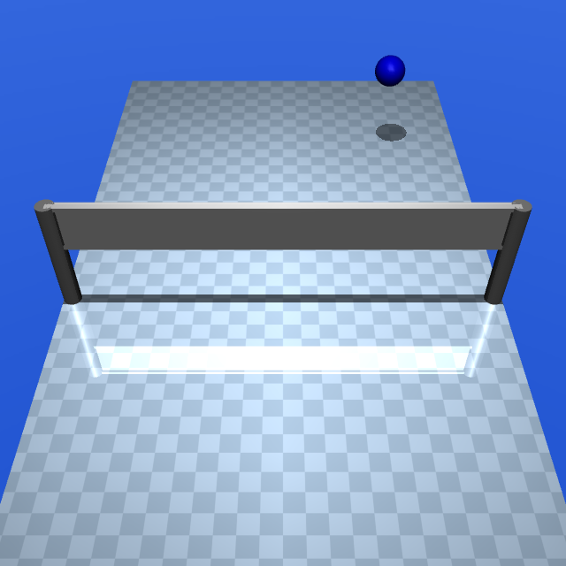
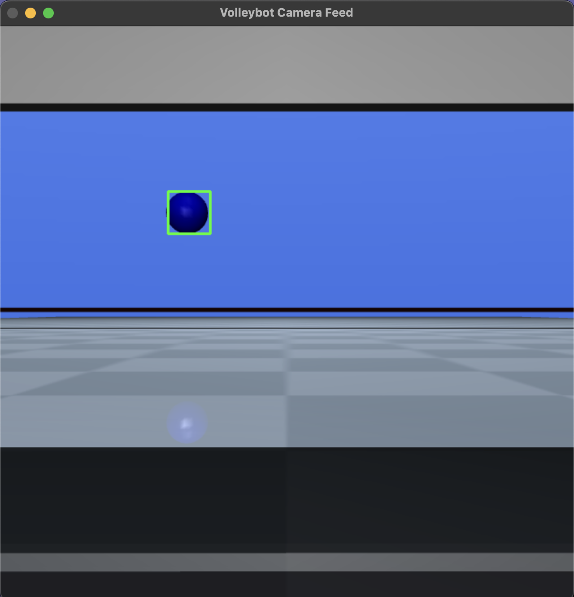

# VOLLEYBOT
A Reinforcement Learning environment for teaching quad-wheel robots to play volleyball.

<p float="left">
  
  
</p>

---

## Installation Instructions

```bash
conda create --name volleybot python=3.12
conda activate volleybot
pip install pybind11
pip install -r requirements.txt
cd refactored_volleybot
pip install -e .
cd ..
```

---

## Testing Instructions

To begin, run scripts from the `scripts/` folder to test out different views.

**To see the robot's POV:**
```bash
python -m agents.camera_livefeed
```

**To train a basic PPO policy and spectate the robot:**
```bash
python -m scripts.stable_agent_PPO
python -m scripts.spectate_agent
```

---

## Environment Structure

```
├── agents/
│   ├── camera_livefeed.py
│   ├── spectate_agent.py
│   ├── stable_agent_PPO.py
│   ├── test.py
│   └── train_agent.py
├── logs/
│   └── wandb/
├── models/
├── README.md
├── refactored_volleybot/
│   ├── examples/
│   ├── physics_engine/
│   │   ├── bindings/
│   │   ├── build/
│   │   ├── CMakeLists.txt
│   │   ├── include/
│   │   └── src/
│   └── setup.py
├── requirements.txt
├── scripts/
│   └── train.py
├── src/
│   ├── models/
│   │   ├── agent.py
│   │   └── ppo_model.py
│   └── utils/
│       ├── calculate_reward.py
│       └── extract_observation.py
└── volleyballenv/
    ├── envs/
    │   ├── assets/
    │   └── VolleybotEnv.py
    ├── README.md
    └── wrappers/
```

---

## Project Notes

Currently undergoing refactoring to use a custom, lightweight C/C++ physics simulator. 

---

## Todo

- [x] Kinematics (Verlet integration)  
- [x] C++ integration for creating objects  
- [x] Lighting  
- [x] Basic material properties  
- [x] Camera angle mathematics  
- [ ] Collision detection & processing  
- [ ] Renderer  
- [ ] Switch from storing 3D vector position and 3×3 matrix for rotation to a 7-dim state (3D for location, 4D for rotation quaternion)  
- [ ] Python bindings  
